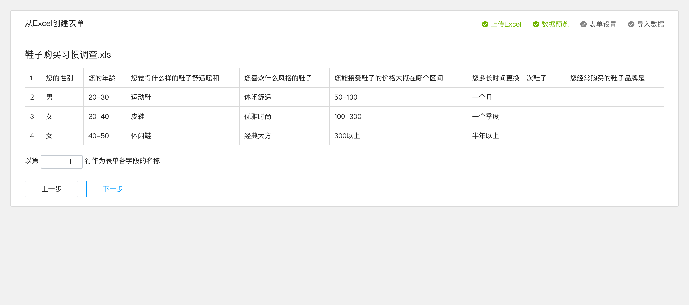
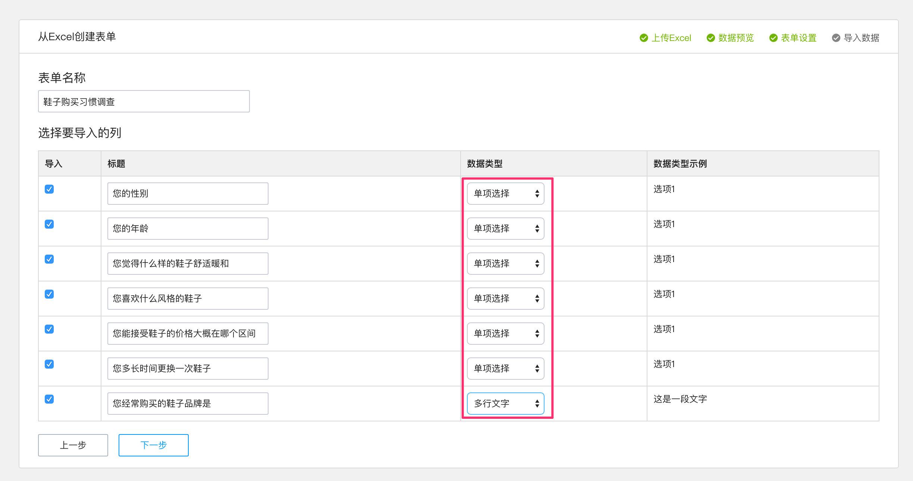

如果您有现成的excel表格，金数据支持您从excel创建表单。但是，您的excel表格必须按如下的样式整理好，如果您的表单中含有单选或者多选，则需要都在相对应的列一一列出，如下图的“您的性别”和“您的年龄”字段。

######如果您的表单中含有图片单选、图片多选、地理字段、矩阵单选、两级下拉框、评分等字段或者表单中某两个字段的名称一样，都会导致无法通过excel创建。

 

如果您的表单中含有图片单选、图片多选、地理字段、矩阵单选 、两级下拉框、评分等字段或者表单中某两个字段的名称一样，都会导致无法通过excel创建。

1. 进入主页面，点击左上方的加号。
    

2. 点击从excel创建表单。
   

3. 上传excel，进行电击“下一步”进行预览。
	

4. 表单设置，这里主要对数据类型进行相应的设置。需要注意的是金数据目前通过excel导入数据仅支持单行文本、多行文本、单项选择、多项选择、数字、邮箱、日期、下拉框、电话、手机、网址。
	

5. 点击“下一步”，上传成功后，进行数据预览。
