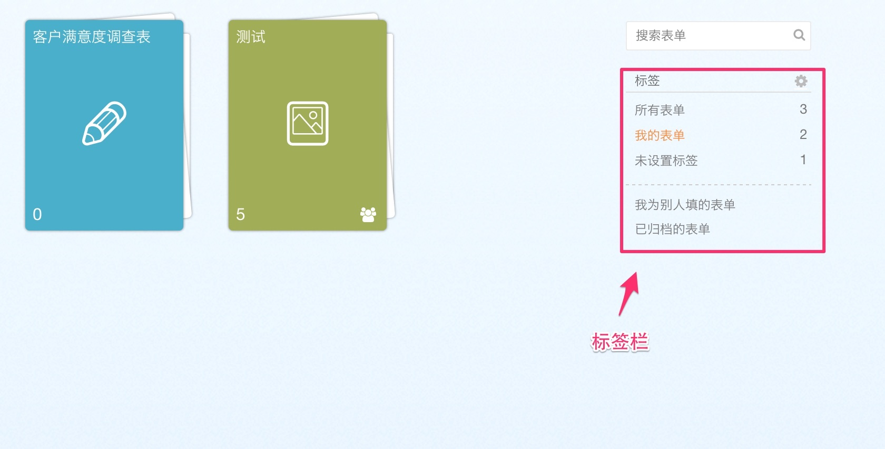
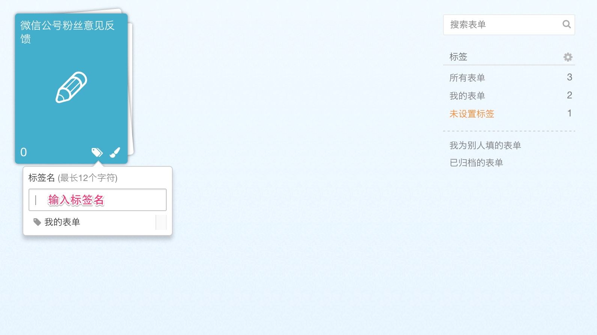
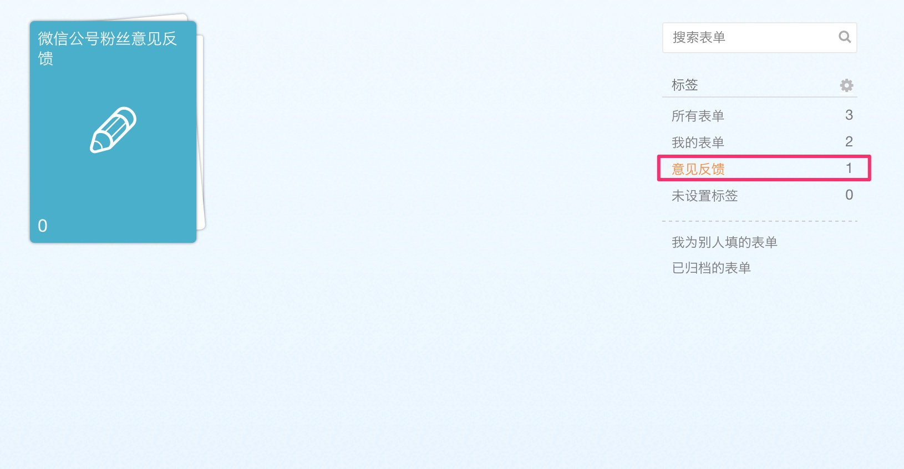
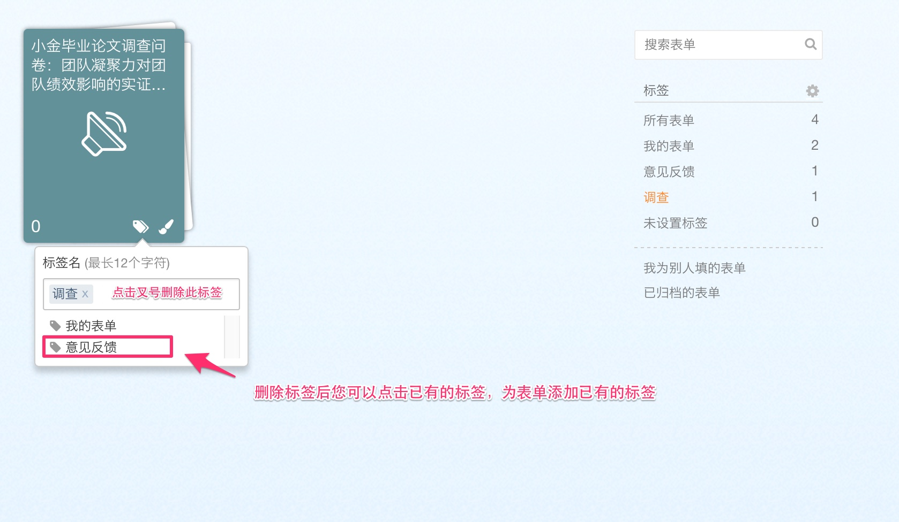
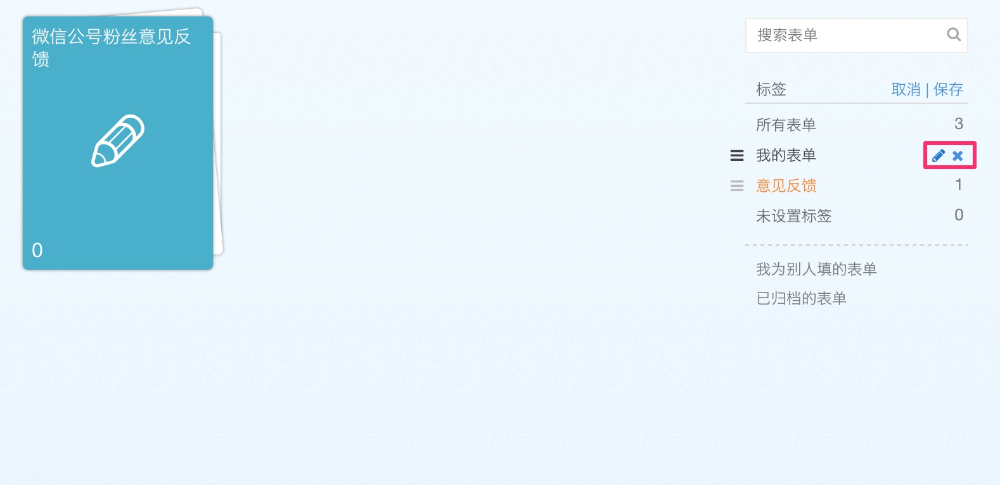
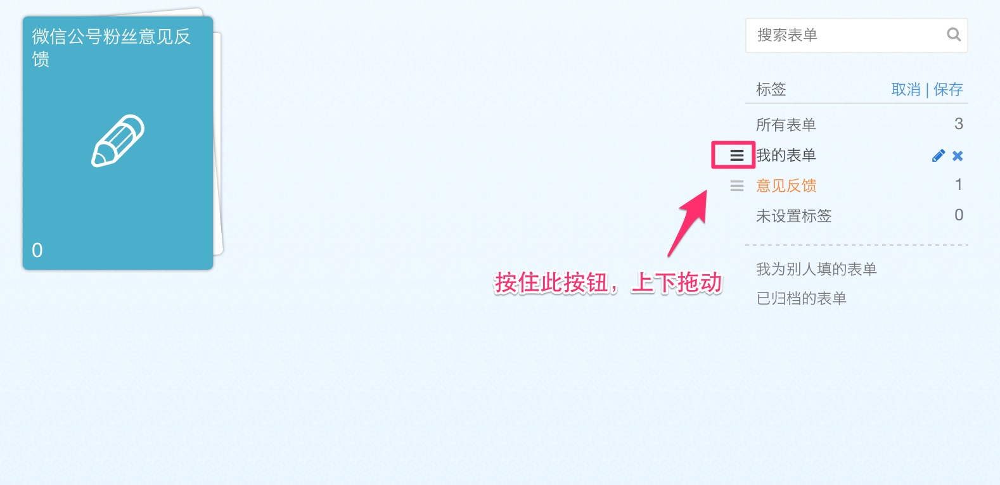

表单太多，不好寻找怎么办？不要担心，您可以使用标签来管理您的表单。

###### 如果您之前使用过分组功能，我们已帮您转成相同的标签名，请放心使用！

### 为表单添加标签

将光标悬停在想要添加标签的表单上，表单的右下角会出现标签的按钮，鼠标悬停在此按钮，会出现“编辑标签”的字样，您可以点击后在弹出的框中输入想要添加的标签名。
  

添加成功后，会在右边的标签栏看到新创建的标签，点击后可以看到对应的表单。
  

### 为表单修改标签

如果您需要为某个表单修改标签，您可以把鼠标悬停在想要修改标签的表单上，然后点击标签图标，接下来就可以在弹出的框中删除已有的标签，删除就可以根据自己的需求选择已有的标签，或者添加新的标签。
  

### 编辑所有标签

点击标签后面的设置小按钮，您就可以修改已有标签的名称，或者删除某个标签，删除标签后，原有标签下的表单都会移动到“未设置标签”下。
  
您也可以通过左边的图标调整标签的排列顺序。
  
